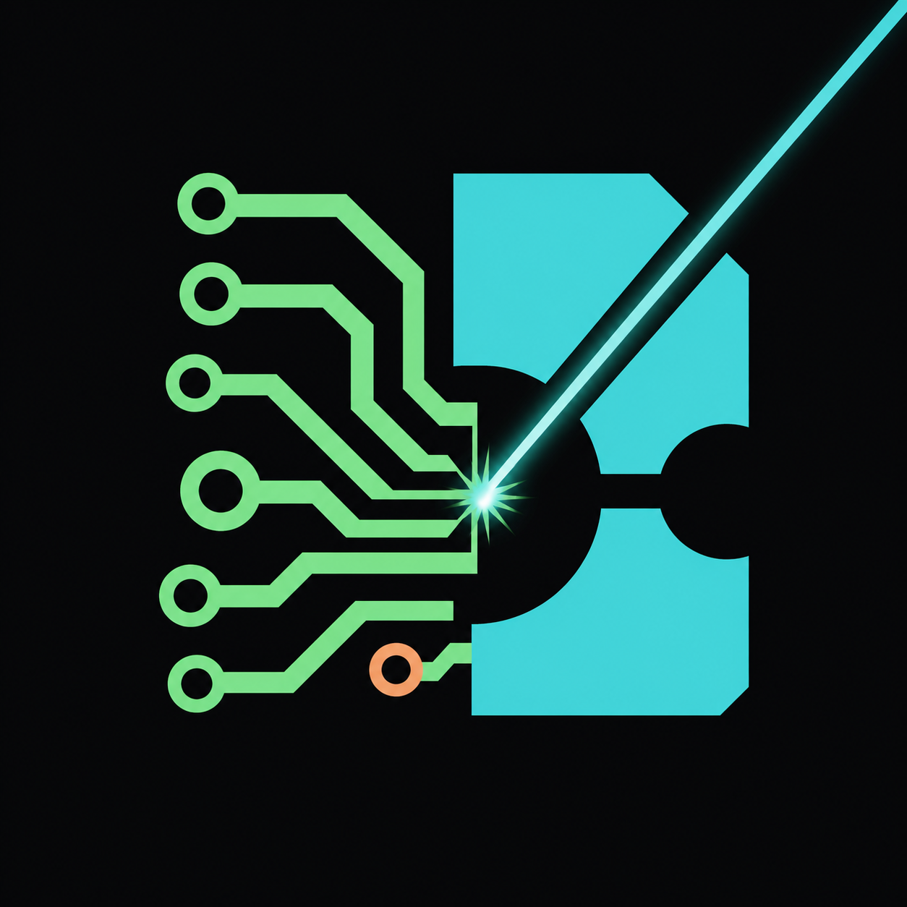
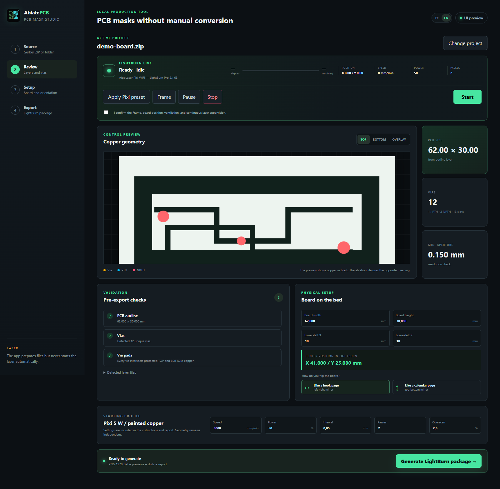

<p align="center">
  
</p>

<h1 align="center">AblatePCB Studio</h1>

<p align="center">
  A local-first Windows desktop studio for turning Gerber/Excellon fabrication packages into validated PCB paint-ablation masks, with an independent LightBurn integration.
</p>

<p align="center">
  <a href="https://github.com/mateuszsury/ablatepcb-studio/actions/workflows/ci.yml"></a>
  <a href="LICENSE"></a>
  
  
</p>

> Polish documentation: [docs/README.pl.md](docs/README.pl.md)



## Why this exists

AblatePCB Studio removes the fragile manual steps between an EDA fabrication export and a two-sided laser-resistant PCB mask. It detects the board outline, copper layers, Excellon drills, vias, plated/non-plated holes, and slots; validates their geometry; then generates deterministic 1270 DPI ablation images that can be loaded into LightBurn.

The converter is vendor-neutral. EasyEDA, KiCad, Altium, standard RS-274X Gerber, and Excellon naming conventions are recognized. The included **AlgoLaser Pixi 5 W** profile is a starting preset, not a device lock-in.

## Highlights

- Automatic Gerber/Excellon layer detection from a ZIP or extracted folder.
- TOP and BOTTOM masks with both physical flip alternatives.
- Outline, via, PTH, NPTH, slot, minimum-feature, and copper-bound checks.
- Pixel-accurate 1270 DPI output, preview images, drill and registration guides.
- Configurable board origin, blank size, speed, power, interval, passes, and overscan.
- Safe LightBurn integration: load TOP/BOTTOM, apply the active-layer preset, Frame, Pause, Stop, and explicitly confirmed Start.
- Live LightBurn state, controller state, XY position, feed, power, progress, elapsed time, and ETA.
- Polish and English interface with a locally persisted language choice.
- Offline processing. Project data is not uploaded anywhere.

## Safe workflow

1. Export a fabrication ZIP from your EDA tool.
2. Drop the ZIP into the app and review every validation result.
3. Set the physical blank size and its lower-left bed coordinate. The default is **X=10 mm, Y=10 mm**.
4. Choose how the board will be flipped after the first side.
5. Generate the LightBurn package.
6. Load TOP or BOTTOM into LightBurn, apply the preset, and run **Frame**.
7. Confirm the board position, ventilation, eye protection, fire safety, and continuous supervision.
8. Only then use Start. The default Pixi profile uses **2 passes**.

The Start action requires both a safety checkbox and a second confirmation. Importing a file or applying a preset never starts the laser.

## Installation

### Run from source

```powershell
git clone https://github.com/mateuszsury/ablatepcb-studio.git
cd ablatepcb-studio
py -3 -m venv .venv
.\.venv\Scripts\Activate.ps1
python -m pip install -e ".[dev]"
python app.py
```

### Build the Windows application

```powershell
.\build_windows.ps1
```

The unpacked application is written to `dist\AblatePCBStudio`. Build artifacts are intentionally excluded from Git.

## Command-line conversion

```powershell
ablatepcb analyze "C:\fabrication\board.zip"
ablatepcb generate "C:\fabrication\board.zip" `
  --blank 70 50 --origin 10 10 --flip left_right
```

## Output package

| File | Purpose |
|---|---|
| `01_TOP_ablation.png` | Top-side paint ablation mask |
| `02_BOTTOM_selected_ablation.png` | Bottom mask using the selected flip method |
| `alternatives/` | Other bottom-side orientation |
| `DRILL_GUIDE.svg` | Drill and slot reference |
| `REGISTRATION_GUIDE.svg` | Two-sided alignment aid |
| `RAPORT.html` | Human-readable conversion and validation report |
| `manifest.json` | Machine-readable geometry and preset metadata |
| `INSTRUKCJA.txt` | Production notes and LightBurn coordinates |

In ablation masks, white means copper that remains protected by paint; black means paint to remove.

## LightBurn integration

File loading, liveness checks, and Start use LightBurn's documented localhost UDP automation interface. Detailed status, ETA, active-layer values, Frame, Pause, and Stop are read or invoked through Windows UI Automation. `FORCELOAD` is deliberately not used, so unsaved LightBurn work is never discarded without its own prompt.

The integration has been tested with **LightBurn 2.1.03 on Windows**. This is a compatibility statement, not a claim of official certification or endorsement. Because LightBurn UI identifiers can change between versions, AblatePCB Studio fails visibly when it cannot identify a control instead of guessing.

See [docs/lightburn-integration.md](docs/lightburn-integration.md) for the exact safety boundary and compatibility notes.

## Verification

```powershell
python -m compileall -q app.py ablatepcb tests
python -m pytest
```

The portable test suite covers detection and Excellon parsing. An optional golden test compares a real mask pixel-for-pixel when `GERBER_GOLDEN_ZIP` and `GERBER_GOLDEN_REFERENCE` are set.

## Documentation

- [Architecture](docs/architecture.md)
- [PCB production workflow](docs/pcb-workflow.md)
- [LightBurn integration](docs/lightburn-integration.md)
- [Contributing](CONTRIBUTING.md)
- [Security policy](SECURITY.md)

## Important limitations

- This is not an EDA design-rule checker and does not validate the electrical netlist.
- Home etching does not plate through-holes. Vias must be connected with wire, rivets, or another suitable process.
- Laser/material values are starting points only. Calibrate with a safe material test.
- LightBurn desktop control is Windows-specific and depends on compatible LightBurn UI identifiers.
- Never leave a laser unattended. Keep suitable fire suppression nearby and follow the device manufacturer's safety instructions.

## License and trademarks

Released under the [MIT License](LICENSE).

This project is independent and is not affiliated with, endorsed by, or sponsored by LightBurn Software, AlgoLaser, EasyEDA, KiCad, or Altium. LightBurn and the other product names and marks belong to their respective owners and are used only to identify compatible products and intended interoperability. **AblatePCB Studio** is the name of this project; LightBurn is not part of its name or branding.
