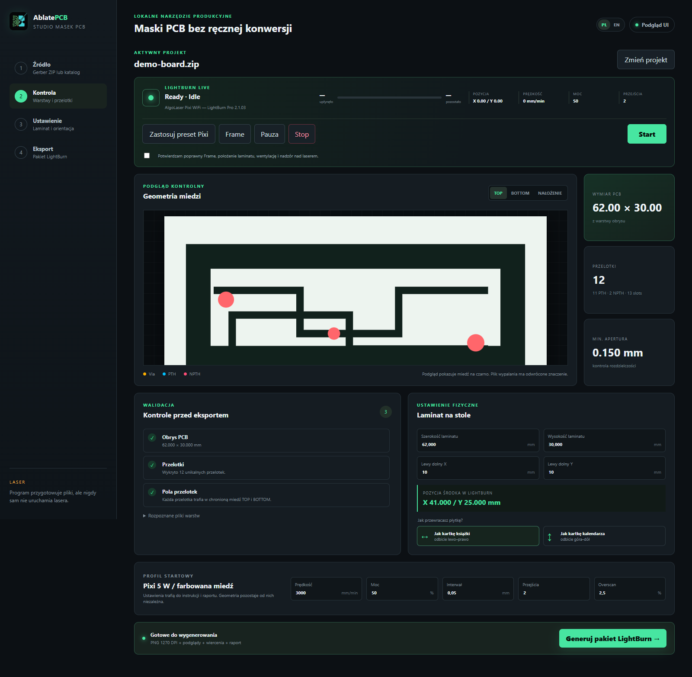

# AblatePCB Studio

[English README](../README.md)

AblatePCB Studio to lokalna aplikacja Windows, która zamienia paczki produkcyjne Gerber/Excellon na zweryfikowane maski ablacji farby dla jednostronnych i dwustronnych płytek PCB oraz zapewnia niezależną integrację z LightBurn.



## Najważniejsze możliwości

- rozpoznawanie EasyEDA, KiCad, Altium, RS-274X i Excellon;
- wykrywanie TOP/BOTTOM, obrysu, przelotek, PTH, NPTH i slotów;
- maski 1270 DPI, oba warianty odwrócenia BOTTOM, podglądy i prowadnice;
- domyślna pozycja lewego dolnego rogu laminatu X=10 mm, Y=10 mm;
- konfigurowalne: rozmiar laminatu, pozycja, moc, prędkość, interwał, overscan i liczba przejść;
- preset startowy AlgoLaser Pixi 5 W z 2 przejściami;
- LightBurn Live: stan, ETA, XY, prędkość, moc, Frame, Pauza, Stop i potwierdzony Start;
- stan połączenia, przycisk otwierania LightBurn i preset Pixi dostępne od razu, bez wczytywania Gerbera;
- przełącznik PL/EN zapamiętywany lokalnie;
- całkowicie lokalne przetwarzanie plików.

## Szybki start

```powershell
git clone https://github.com/mateuszsury/ablatepcb-studio.git
cd ablatepcb-studio
py -3 -m venv .venv
.\.venv\Scripts\Activate.ps1
python -m pip install -e ".[dev]"
python app.py
```

## Zalecany proces

1. Wyeksportuj ZIP produkcyjny z programu EDA.
2. Upuść go w aplikacji i sprawdź wszystkie walidacje.
3. Podaj wymiary surowego laminatu i jego lewy dolny narożnik na stole.
4. Wybierz fizyczny sposób odwrócenia płytki.
5. Wygeneruj pakiet.
6. Wczytaj stronę TOP lub BOTTOM do LightBurn; aplikacja ustawi i zweryfikuje pozycję oraz zastosuje preset.
7. Wykonaj Frame oraz sprawdź pozycję, wentylację, ochronę oczu i bezpieczeństwo pożarowe.
8. Dopiero wtedy potwierdź Start i pozostań przy urządzeniu.

Wczytanie pliku ani zastosowanie presetu nie uruchamia lasera. Start wymaga checkboxa bezpieczeństwa oraz dodatkowego potwierdzenia.

Jeżeli nie wczytano jeszcze Gerbera, preset zmienia wyłącznie prędkość, moc, interwał i liczbę przejść aktywnej warstwy LightBurn. Rozmiar, pozycja obrazu i tryb współrzędnych pozostają bez zmian.

Po wygenerowaniu pakietu przyciski TOP/BOTTOM importują maskę do bieżącego projektu LightBurn, ustawiają jej rozmiar i pozycję, a następnie odczytują wartości z LightBurn. Sukces jest zgłaszany dopiero po potwierdzeniu faktycznego lewego dolnego rogu obrazu.

Integrację sprawdzono z **LightBurn 2.1.03 w Windows**. Jest to opis kompatybilności, a nie deklaracja oficjalnej certyfikacji lub poparcia. Jeżeli identyfikatory interfejsu zmienią się w przyszłej wersji LightBurn, aplikacja pokaże błąd zamiast zgadywać kontrolkę.

## Ograniczenia

Aplikacja nie zastępuje DRC ani kontroli netlisty. Domowe trawienie nie metalizuje otworów, dlatego przelotki trzeba połączyć drutem, nitami lub inną metodą. Parametry lasera są tylko punktem startowym i wymagają kalibracji dla konkretnej farby oraz laminatu.

Projekt jest niezależny i nie jest powiązany, zatwierdzony ani sponsorowany przez LightBurn Software, AlgoLaser, EasyEDA, KiCad lub Altium. LightBurn i pozostałe nazwy oraz znaki produktów należą do ich właścicieli i są używane wyłącznie do wskazania kompatybilności oraz przeznaczenia integracji. Nazwą projektu jest **AblatePCB Studio**; LightBurn nie jest częścią jego nazwy ani identyfikacji wizualnej.
